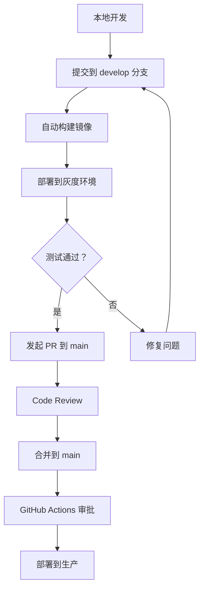

# 🚀 南风博客 - 部署指南

> 企业级灰度发布架构部署文档

---

## 📋 目录

1. [架构概览](#架构概览)
2. [环境要求](#环境要求)
3. [快速开始](#快速开始)
4. [配置说明](#配置说明)
5. [部署流程](#部署流程)
6. [金丝雀发布](#金丝雀发布)
7. [监控与日志](#监控与日志)
8. [故障排查](#故障排查)

---

## 架构概览

### 环境隔离

```
┌─────────────────────────────────────────────┐
│         GitHub (单一代码源)                 │
└─────────────────────────────────────────────┘
                    ↓
        ┌───────────┴───────────┐
        ↓                       ↓
   灰度环境                生产环境
 gray.ainanfeng.cn     ainanfeng.cn
   Docker              Docker
   Container           Container
      ↓                   ↓
 Port 8081            Port 8082
      └───────┬───────────┘
              ↓
      Nginx 反向代理
    (金丝雀路由 + SSL)
              ↓
         用户访问
```

### 核心特性

✅ **一套代码**：所有环境使用同一代码库  
✅ **数据共享**：通过 Docker Volume 共享数据  
✅ **完全隔离**：独立的容器、网络、资源配置  
✅ **审批流程**：生产部署需手动确认  
✅ **金丝雀发布**：支持流量比例分流  
✅ **自动回滚**：健康检查失败自动回滚  

---

## 环境要求

### 硬件要求

| 组件 | CPU | 内存 | 磁盘 |
|------|-----|------|------|
| 基础部署 | 2 核 | 4GB | 20GB |
| 完整部署（含监控） | 4 核 | 8GB | 50GB |

### 软件要求

- Docker 20.10+
- Docker Compose 2.0+
- Git
- SSL 证书（Let's Encrypt 免费）

### 域名配置

需要配置以下 DNS 记录：

```dns
ainanfeng.cn      A     <服务器 IP>
www.ainanfeng.cn  CNAME ainanfeng.cn
gray.ainanfeng.cn A     <服务器 IP>
monitor.ainanfeng.cn A  <服务器 IP>  # 可选
metrics.ainanfeng.cn A  <服务器 IP>  # 可选
```

---

## 快速开始

### 1. 克隆项目

```bash
git clone https://github.com/nanfeng2021/blog.git
cd blog
```

### 2. 配置环境变量

```bash
cp .env.example .env
nano .env  # 编辑配置
```

**必填配置**:

```bash
# Docker Hub 认证
DOCKERHUB_USERNAME=your-username
DOCKERHUB_TOKEN=your-token

# Umami 统计（可选）
UMAMI_APP_SECRET=your-secret

# Grafana 密码（可选）
GRAFANA_ADMIN_PASSWORD=your-password
```

### 3. 获取 SSL 证书

```bash
# 使用 Certbot 获取免费证书
sudo apt install certbot python3-certbot-nginx

sudo certbot certonly --standalone \
  -d ainanfeng.cn \
  -d www.ainanfeng.cn \
  -d gray.ainanfeng.cn

# 复制证书到项目目录
sudo mkdir -p nginx/ssl
sudo cp /etc/letsencrypt/live/ainanfeng.cn/fullchain.pem nginx/ssl/
sudo cp /etc/letsencrypt/live/ainanfeng.cn/privkey.pem nginx/ssl/
```

### 4. 一键部署

```bash
# 部署灰度环境
./scripts/deploy.sh gray

# 部署生产环境
./scripts/deploy.sh production

# 部署所有环境
./scripts/deploy.sh all
```

---

## 配置说明

### Docker Compose 配置

```yaml
services:
  blog-production:  # 生产环境
    ports:
      - "8082:80"   # 宿主机端口 8082
    environment:
      - VITE_ENV=production
  
  blog-gray:  # 灰度环境
    ports:
      - "8081:80"   # 宿主机端口 8081
    environment:
      - VITE_ENV=gray
  
  nginx-proxy:  # 反向代理
    ports:
      - "80:80"     # HTTP
      - "443:443"   # HTTPS
```

### Nginx 金丝雀配置

编辑 `nginx/conf.d/default.conf`:

```nginx
# 金丝雀发布比例
set $canary_ratio 0.1;  # 10% 流量到灰度

# 基于 Cookie 的路由
if ($http_cookie ~* "gray_test=true") {
    set $backend "blog_gray";
}
```

### GitHub Actions 配置

在 GitHub 仓库设置中添加 Secrets:

1. **Settings → Secrets and variables → Actions**
2. 添加以下 secrets:
   - `DOCKERHUB_USERNAME`: Docker Hub 用户名
   - `DOCKERHUB_TOKEN`: Docker Hub Access Token
   - `UMAMI_APP_SECRET`: Umami 统计密钥（可选）

---

## 部署流程

### 开发流程



### 详细步骤

#### 1. 功能开发（灰度环境）

```bash
# 本地开发
npm run dev

# 推送到 develop 分支
git checkout -b feature/new-feature
git commit -m "feat: add new feature"
git push origin feature/new-feature

# 创建 PR 到 develop
```

#### 2. 灰度测试

```bash
# 自动部署到 gray.ainanfeng.cn
# GitHub Actions 会自动：
# 1. 构建 Docker 镜像
# 2. 推送到 Docker Hub
# 3. 部署到灰度环境
# 4. 运行健康检查
```

**访问灰度环境**:
- URL: https://gray.ainanfeng.cn
- 特征：页面右上角有"🧪 灰度测试环境"标识

#### 3. 生产发布（需审批）

1. **发起发布请求**
   ```bash
   git checkout main
   git merge develop
   git push origin main
   ```

2. **等待 CI/CD 完成**
   - 访问 GitHub Actions 查看进度
   - 灰度环境自动更新

3. **审批生产部署**
   - 在 GitHub Actions 中点击 "Review pending deployments"
   - 选择 Approve
   - 生产环境开始部署

4. **验证部署**
   ```bash
   # 查看状态
   ./scripts/deploy.sh status
   
   # 查看日志
   ./scripts/deploy.sh logs blog-production
   ```

---

## 金丝雀发布

### 什么是金丝雀发布？

金丝雀发布是一种渐进式部署策略，将少量流量引导到新版本，验证稳定性后再全量发布。

### 配置方式

#### 方法 1：基于流量比例

编辑 `nginx/conf.d/default.conf`:

```nginx
# 修改这个值（0.0-1.0）
set $canary_ratio 0.1;  # 10% 流量
```

#### 方法 2：基于 Cookie（推荐）

用户可以主动加入灰度测试：

```javascript
// 在浏览器控制台执行
document.cookie = "gray_test=true; max-age=86400; domain=.ainanfeng.cn"
```

刷新页面后，该用户将始终访问灰度环境（24 小时）。

#### 方法 3：基于 URL 参数

```bash
# 访问时添加 ?canary=true 参数
https://ainanfeng.cn/?canary=true
```

### 监控指标

部署后需要监控：

1. **错误率**: 应该 < 0.1%
2. **响应时间**: P95 < 500ms
3. **用户反馈**: 收集灰度环境用户意见

---

## 监控与日志

### Prometheus 监控

访问：http://metrics.ainanfeng.cn:9090

**关键指标**:
- `nginx_http_requests_total`: 请求总数
- `nginx_upstream_response_time`: 后端响应时间
- `node_memory_usage`: 内存使用率
- `container_cpu_usage`: CPU 使用率

### Grafana 可视化

访问：http://monitor.ainanfeng.cn:3000

**默认账号**:
- Username: `admin`
- Password: 配置的 `GRAFANA_ADMIN_PASSWORD`

**预置仪表盘**:
- Nginx 性能监控
- Docker 容器资源
- 应用健康状态

### 日志聚合（Loki）

查看日志：

```bash
# 实时日志
./scripts/deploy.sh logs

# 查看特定服务
./scripts/deploy.sh logs blog-production

# 查看 Nginx 日志
docker-compose logs nginx-proxy | grep "error"
```

日志格式（JSON）:

```json
{
  "time_local": "18/Apr/2026:14:30:00 +0800",
  "remote_addr": "192.168.1.100",
  "request": "GET / HTTP/2.0",
  "status": "200",
  "request_time": "0.052",
  "environment": "production"
}
```

---

## 故障排查

### 常见问题

#### 1. 容器启动失败

```bash
# 查看容器状态
docker-compose ps

# 查看详细日志
docker-compose logs blog-production

# 重启服务
docker-compose restart blog-production
```

#### 2. Nginx 无法访问

```bash
# 检查端口占用
netstat -tlnp | grep :80

# 检查 SSL 证书
openssl x509 -in nginx/ssl/fullchain.pem -text -noout

# 测试 Nginx 配置
docker-compose exec nginx-proxy nginx -t
```

#### 3. 金丝雀发布不生效

```bash
# 检查 Nginx 配置
cat nginx/conf.d/default.conf | grep canary

# 清除浏览器缓存和 Cookie
# 或使用无痕模式测试

# 强制指定用户到灰度
curl -H "Cookie: gray_test=true" https://ainanfeng.cn
```

#### 4. 健康检查失败

```bash
# 手动检查健康端点
curl http://localhost:8082/health

# 查看应用日志
docker-compose logs blog-production | tail -50

# 进入容器调试
docker-compose exec blog-production sh
```

### 回滚操作

```bash
# 回滚到上一个版本
docker tag nanfeng2021/ainanfeng-blog:previous nanfeng2021/ainanfeng-blog:latest
docker-compose restart blog-production

# 或者使用 Git 回滚
git revert HEAD
git push origin main
```

---

## 高级配置

### 自定义资源限制

编辑 `docker-compose.yml`:

```yaml
services:
  blog-production:
    deploy:
      resources:
        limits:
          cpus: '2.0'      # 最大 2 核
          memory: 1G       # 最大 1GB 内存
        reservations:
          cpus: '1.0'      # 保证 1 核
          memory: 512M     # 保证 512MB
```

### 多实例部署

```yaml
services:
  blog-production:
    deploy:
      replicas: 3  # 运行 3 个实例
      update_config:
        parallelism: 1     # 每次更新 1 个
        delay: 10s         # 间隔 10 秒
```

### 自动扩缩容

需要 Docker Swarm 或 Kubernetes 支持。

---

## 安全建议

1. **定期更新**: 保持 Docker 和系统更新
2. **最小权限**: 容器以非 root 用户运行
3. **网络安全**: 只暴露必要端口
4. **日志审计**: 定期检查访问日志
5. **备份策略**: 定期备份数据和配置

---

## 相关文档

- [Docker 官方文档](https://docs.docker.com/)
- [Nginx 配置指南](https://nginx.org/en/docs/)
- [GitHub Actions 文档](https://docs.github.com/en/actions)
- [Prometheus 监控](https://prometheus.io/docs/)

---

_最后更新：2026-04-18_  
_维护者：南风 & 旺财 🐕_
